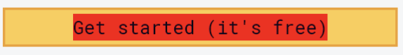

# Dom Manipulation Assignment

1. Webiste Name: [Dev To](https://dev.to/)

### Topics

    - Query Selctory, Inner HTML
`
### Sample Image


### Tasks

        Target the Top description div and change the DEV Community to <Your_Name> and description to your passion


### Code
```
document.querySelector(".side-bar .crayons-subtitle-2").innerHTML = "iNeuron"
document.querySelector(".side-bar .color-base-70").innerHTML = "I Write Code "
```


### Output


2. Website Name: [Apple](https://support.apple.com/en-in)

### Task


### Fetch all the product name and store in an array

### Code
```
 let elements = document.querySelectorAll("a .as-imagegrid-item-title")
let eleArr = [...elements]
let ans = eleArr.map(e=>{
    return e.firstChild.textContent;
})
```


### Output

['iPhone', 'Mac', 'iPad', 'Watch', 'AirPods', 'Music', 'TV']

3. Webiste Name: [Youtube Support](https://support.google.com/youtube/)

### Topics

    - Get Element By Id, Create Element, Create Text Node, Append Child

### Sample Image


### Tasks

     Add another FAQ 'My New FAQ' to the list

 ### Code
```
let card = document.querySelector(".article .accordion-homepage"); 
let list = document.createElement("section"); 
list.className = "parent";
list.appendChild(document.createElement("h3")); 
list.querySelector("h3").textContent = "My New FAQ";
card.appendChild(list);
```    

### Output


4. Webiste Name: [OnePlus](https://www.oneplus.in/support)

### Topics

     Query Selector, InnerText

### Sample Image


### Tasks

      Change the contact number

 ### Code
```
let element = document.querySelector(".one-tel-number")
element.innerHTML = "+91 6366256689"
```  
### Output


5. Webiste Name: [Samsung](https://www.samsung.com/in/offer/online/samsung-fest/)

### Topics

       getElementById, createElement, InnerText, append, setAttribute

### Sample Image


### Tasks

     Target the main div of card and change the Button text to Check out

 ### Code
```
let oldBtn = document.querySelector('.feature-column-carousel__feature .feature-column-carousel__content .feature-column-carousel__button a')
oldBtn.style.display = 'none'
let newBtn = document.createElement('button')
newBtn.setAttribute('class','cta cta--contained cta--black')
newBtn.innerText = 'check out'

document.querySelector('.feature-column-carousel__feature .feature-column-carousel__content .feature-column-carousel__button').append(newBtn)

```  

### Output


6. Webiste Name: [Adidas](https://www.adidas.co.in/)

### Topics

    -   Query Selector, Event listeners, Changing Styles

### Sample Image


### Tasks

     Target the search box and on hover change thebackground color to red.


 ### Code
```
let searchBar = document.querySelector('.searchinput___19uW0')
searchBar.addEventListener('mouseover', ()=> searchBar.style.backgroundColor='red')
```  

### Output


7. Webiste Name: [MDN Web Docs](https://developer.mozilla.org/en-US/)

### Topics

       Form, Value, Submit

### Sample Image


### Tasks

     To Search a topic in the MDN Search bar.
     First add a text to search in the search bar and then hit the submit search button to search the docs using DOM

### Output


8. Webiste Name: [Google](https://www.google.com/)

### Topics

       Remove Elements

### Sample Image


### Tasks

     Remove alternate languages from the home page languages listed

 ### Code
```
let altLang = document.querySelectorAll('#SIvCob a')
altLang.forEach((e,index) => { if(index%2==0) {e.remove()}  })
``` 
### Output


9. Webiste Name: [Code Wars](https://www.codewars.com/)

### Topics

       Change Font Family, Color of Text.

### Sample Image


### Tasks

    Change the font family of the text to monospace and text color to the logo’s background color.

 ### Code
```
let heading2 = document.querySelector('.text-color-white')
heading2.style.fontFamily= 'monospace'
heading2.style.color= '#BF3312'
``` 

### Output


10. Webiste Name: [Freecodecamp](https://www.freecodecamp.org/)

### Topics

       querySelector, mouseover, click eventListener,  callback function, style,

### Sample Image


### Tasks

    Target the button and change background colour on mouseover

 ### Code
```
let loginBtn = document.querySelector('.btn-cta-big')
loginBtn.lastChild.addEventListener('mouseover',e=>{
    e.currentTarget.style.backgroundColor = 'red'        
})
``` 

### Output



11. Webiste Name: [realme](https://www.realme.com/in/)

### Topics

       querySelector,style,background-image

### Sample Image


### Tasks

    change the realme logo to ineuron logo

 ### Code
```
document.querySelector(".logo .icon").style.backgroundImage = "url('https://ineuron.ai/images/ineuron-logo.png')";
``` 

### Output


12. Webiste Name: [Github](https://github.com/)

### Topics

       querySelector,style,background-Color

### Sample Image


### Tasks

     change the background colour of the button to blue.

 ### Code
```
let newBtn = document.querySelector('.dashboard-sidebar .Details .js-repos-container .f4 .btn')
newBtn.style.backgroundColor='blue'
```

### Output


13. Webiste Name: [Hackerrank](https://www.hackerrank.com/)

### Topics

       querySelector,innerHtml

### Sample Image


### Tasks

Target the top description and change “Matching developers with great companies” to ‘JSBOOTCAMP“.

### Output


14. Webiste Name: [Asus](https://www.asus.com/in/)

### Topics

      querySelector,style,font-size

### Sample Image


### Tasks

       change the fontsize of “Hot Deals” to 80px

 ### Code
```
document.querySelector('.HotDealsAll__HotCampaignsEventsContainer__FK0V2 .HotDealsAll__Heading__2fIbe').style.fontSize='100px'
```

### Output


15. Webiste Name: [Dell](https://www.dell.com/en-in/shop/deals/laptop-deals?gacd=10415953-9016-5761040-285981356-0&dgc=ST&gclid=Cj0KCQjwguGYBhDRARIsAHgRm4-XUDMhhVNyHXb3s1gY4ZBzORr_d9Se-buhJwy7asyUe7YdqEA11eEaAt6UEALw_wcB&gclsrc=aw.ds&nclid=BxjBlpBQsX6pjSHh-L8YYSU77EpfXRkG1AGMB5Wbeu386ykspfrPDnfx_DdFau20)

### Topics

      querySelector,style.textAlign

### Sample Image


### Tasks

       Convert the text “G15 Gaming Laptop” from left to right

 ### Code
```
let title= document.querySelector('.ps-title')
title.style.textAlign='right'
```

### Output


16. Webiste Name: [Vercel](https://vercel.com/)

### Topics

     querySelector,innerHTMl

### Sample Image


### Tasks

      change the heading “Start with the developer” to “Start with Scratch”

 ### Code
```
let title = document.querySelector('.section-title_title__VEDfK')
title.innerHTML='Start with Scratch'
```

### Output


17. Webiste Name: [Sony](https://www.sony.co.in/)

### Topics

    querySelector,innerHTMl

### Sample Image


### Tasks

     change the button text To current Date.

 ### Code
```
let one = new Date() 
document.querySelector('.btn-container').innerHTML = one
```
### Output


18. Webiste Name: [Philips](https://www.philips.co.in/)

### Topics

     querySelector,style,backgroundcolor

### Sample Image


### Tasks

    change the background colour blue to orange

 ### Code
```
document.querySelector('.p-footer').style.backgroundColor='orange'
```

### Output


19. Webiste Name: [Canon](https://in.canon/)

### Topics

          querySelector,src

### Sample Image


### Tasks

    extract the canon logo

 ### Code
```
document.querySelector(".navbar-brand").innerText = "https://in.canon/assets/brand/logo-300-002e45a4aec98fd92899838da9d5560f.png"
```

### Output


20. Webiste Name: [Oppo](https://www.oppo.com/in/)

### Topics

          querySelector,style,color

### Sample Image


### Tasks

      Change the description colour black to orange

 ### Code
```
document.querySelector('.desc').style.color= 'orange'
```
### Output


